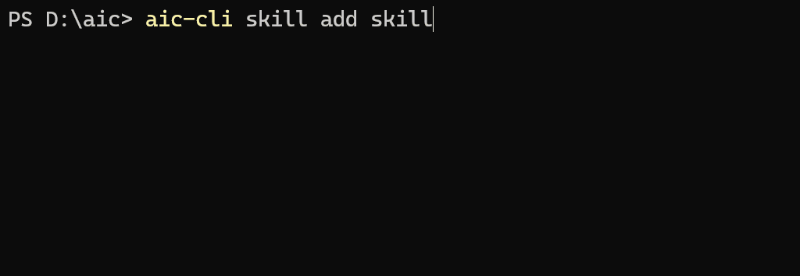
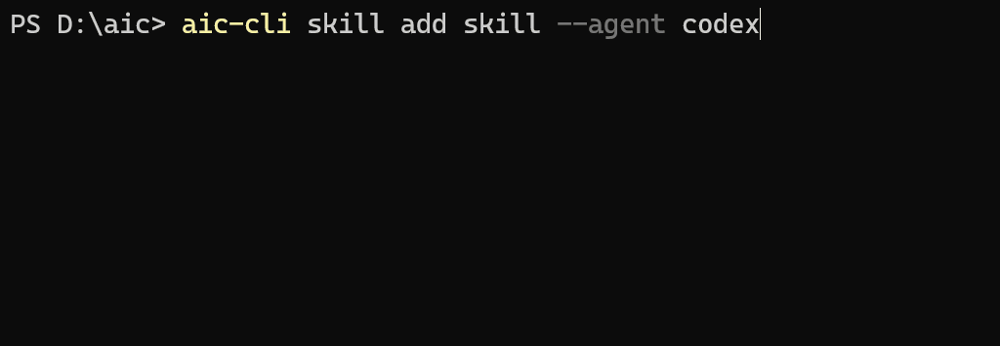
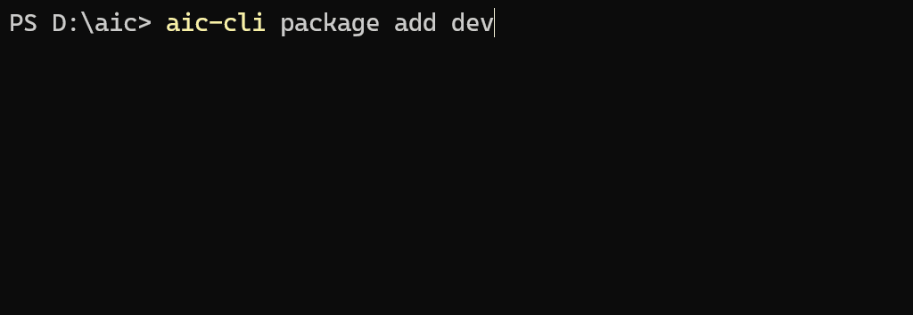

# AIC CLI

> 🚀 Command Line Tool for Managing Coding Agent Skills — Search, Install, Manage, All-in-One

[](https://goreportcard.com/report/github.com/cicbyte/aic-cli)
[](https://opensource.org/licenses/MIT)
[](https://go.dev/dl/)

**[🇨🇳 中文版](README.md)** | **[🇺🇸 English](README_EN.md)**

> AIC CLI is the companion CLI for [AIC](https://github.com/cicbyte/aic) — an open platform for Coding Agent Skills. AIC CLI handles searching, installing, and managing skills from the terminal.

## ✨ Features

- **🔍 Smart Search** — Quickly search skills from AIC server with keyword and category filtering
- **📦 One-Click Install** — Download and install to project or global directory automatically
- **🤖 Multi-Agent Support** — Supports 18 Coding Agents (Claude Code, Cursor, Windsurf, Cline, etc.)
- **🎨 Beautiful TUI** — Built-in interactive terminal interface for visual browsing
- **🗂️ Skill Packages** — Install skills in bulk via packages
- **🔗 Symlinks** — Share skills across projects with symlink management, saving disk space
- **🧹 Cleanup** — Auto-clean broken symlinks to keep your environment tidy

## 📦 Installation

### Requirements

- Go 1.23.2 or higher

### From Source

```bash
git clone https://github.com/cicbyte/aic-cli.git
cd aic-cli
go build -o aic-cli main.go
sudo mv aic-cli /usr/local/bin/  # Linux/macOS
```

### Using Go install

```bash
go install github.com/cicbyte/aic-cli@latest
```

### Download from Release

Visit the [Releases](https://github.com/cicbyte/aic-cli/releases) page to download the binary for your system.

## 🚀 Quick Start

```bash
# Interactive TUI mode (recommended)
aic-cli

# Search skills
aic-cli skill search "frontend"

# Install a skill
aic-cli skill add obsidian

# Install a skill package
aic-cli package add 1

# List installed skills
aic-cli skill list
```

## 📖 Usage

### Skill Management

#### Search skills

```bash
aic-cli skill search "keyword"
aic-cli skill search "frontend" -c 1          # Filter by category
aic-cli skill search "react" -p 1 -n 10       # Pagination
```

#### Add skills

```bash
aic-cli skill add <skill-id>
aic-cli skill add <skill-name>
aic-cli skill add "obsidian" --agent cursor    # Specify target Agent
aic-cli skill add "obsidian" -o ./custom-dir   # Custom output directory
aic-cli skill add "obsidian" -m symlink        # Symlink mode
```



Use `--agent` to specify the target Agent — the skill will be installed into that Agent's skills directory:



#### Download skill zip

```bash
aic-cli skill download <skill-id>
aic-cli skill download "obsidian" -o ./downloads
```

#### Import local skills to server

```bash
aic-cli skill import ./my-skill.zip
aic-cli skill import ./my-skill.zip -d "Skill description" -c 1
```

#### List installed skills

```bash
aic-cli skill list               # Current project
aic-cli skill list -g            # Global directory
aic-cli skill list --agent cursor # Specific Agent
```

#### Remove installed skills

```bash
aic-cli skill remove <skill-name>
aic-cli skill remove <skill-name> -g            # Also delete global source
```

#### Clean broken symlinks

```bash
aic-cli skill clean
```

#### Package skills

```bash
aic-cli skill pack ./my-skill/                  # Default .zip
aic-cli skill pack ./my-skill/ --format skill   # .skill format
```

#### Install mode

```bash
aic-cli skill mode               # Show current mode
aic-cli skill mode symlink       # Switch to symlink mode
aic-cli skill mode copy          # Switch to copy mode
```

### Skill Packages

```bash
aic-cli package list                    # List all packages
aic-cli package list -s "frontend"      # Search packages
aic-cli package add <package-id>        # Add by ID
aic-cli package add "Frontend Tools"    # Add by name
aic-cli package add 1 --agent cursor    # Specify target Agent
```



### Other Commands

```bash
aic-cli server open    # Open AIC web page in browser
aic-cli server status  # Check server connection status
aic-cli version        # Show version info
```

### All Commands

```bash
aic-cli --help
```

| Command | Description |
|---|---|
| `skill search` | Search remote skills |
| `skill add` | Download and install skills |
| `skill download` | Download skill ZIP package |
| `skill import` | Import local skills to server |
| `skill categories` | List all categories |
| `skill list` | List installed skills |
| `skill remove` | Remove installed skills |
| `skill clean` | Clean broken symlinks |
| `skill pack` | Package skill folder |
| `skill mode` | View or switch install mode |
| `package list` | List skill packages |
| `package add` | Install all skills in a package |
| `server open` | Open AIC web page |
| `server status` | Check server status |
| `tui` | Interactive interface |

## 🤖 Multi-Agent Support

AIC CLI can install skills into different Coding Agent directories. Use `--agent` to specify the target:

```bash
aic-cli skill add "react-helper" --agent cursor
aic-cli skill add "react-helper" --agent windsurf
```

Supported Agents:

| Agent | Project Directory | Global Directory |
|-------|------------------|-----------------|
| claude | `.claude/skills/` | `~/.claude/skills/` |
| cursor | `.cursor/rules/` | `~/.cursor/rules/` |
| windsurf | `.windsurf/skills/` | `~/.windsurf/skills/` |
| cline | `.cline/skills/` | `~/.cline/skills/` |
| continue | `.continue/skills/` | `~/.continue/skills/` |
| opencode | `.opencode/skills/` | `~/.config/opencode/skills/` |
| trae | `.trae/skills/` | `~/.trae/skills/` |
| gemini | `.gemini/skills/` | `~/.gemini/skills/` |
| codex | `.codex/skills/` | `~/.codex/skills/` |
| roo | `.roo/skills/` | `~/.roo/skills/` |
| amp | `.amp/skills/` | `~/.amp/skills/` |
| amazonq | `.amazonq/skills/` | `~/.amazonq/skills/` |
| copilot | `.github/prompts/` | `~/.github/prompts/` |
| qoder | `.qoder/skills/` | `~/.qoder/skills/` |
| openclaw | `.openclaw/skills/` | `~/.openclaw/skills/` |
| hermes | — | `~/.hermes/skills/` |
| codebuddy | — | `~/.codebuddy/skills/` |
| qclaw | — | `~/.qclaw/skills/` |

When `--agent` is not specified, AIC CLI auto-detects agents in the current project, prompts for selection if multiple are found, and defaults to Claude Code.

## ⚙️ Configuration

### Config File

Located at `~/.ciclebyte/aic-cli/config/config.yaml`:

```yaml
aic:
  base_url: "https://aic.cicbyte.com"
  token: ""

skills:
  default_mode: "symlink"    # Install mode: symlink or copy
  default_agent: "claude"    # Default Agent
```

### Install Modes

- **symlink** (default) — Downloads to global directory, creates a symlink in the target. Shared across projects, saves disk space. Uses Junction on Windows (no admin required).
- **copy** — Copies files directly to the target directory. Each project has its own independent copy.

## 🏗️ Project Structure

```
aic-cli/
├── cmd/                  # CLI commands (Cobra)
│   ├── skill/            # skill subcommands
│   ├── package/          # package subcommands
│   ├── server/           # server subcommands
│   ├── local/            # list/remove/clean
│   ├── skillzip/         # pack
│   └── tui/              # Interactive interface
├── internal/
│   ├── agent/            # 18 Agent Profile implementations
│   ├── api/              # AIC server API client
│   ├── logic/            # Business logic layer
│   ├── utils/            # Utility functions
│   ├── models/           # Data models
│   └── log/              # Logging module
├── skills/               # Built-in project skills
└── main.go
```

## 🛠️ Development

```bash
# Build
go build -o aic-cli main.go

# Test
go vet ./...
go test ./...
```

## 📄 License

[MIT](LICENSE) © 2026 Cicbyte

## 🙏 Acknowledgments

- [Cobra](https://github.com/spf13/cobra) — CLI framework
- [Bubbletea](https://github.com/charmbracelet/bubbletea) — TUI framework
- [Lipgloss](https://github.com/charmbracelet/lipgloss) — Terminal styling library

---

**Project URL:** [https://github.com/cicbyte/aic-cli](https://github.com/cicbyte/aic-cli)

**Feedback & Suggestions:** Please submit [Issues](https://github.com/cicbyte/aic-cli/issues)
